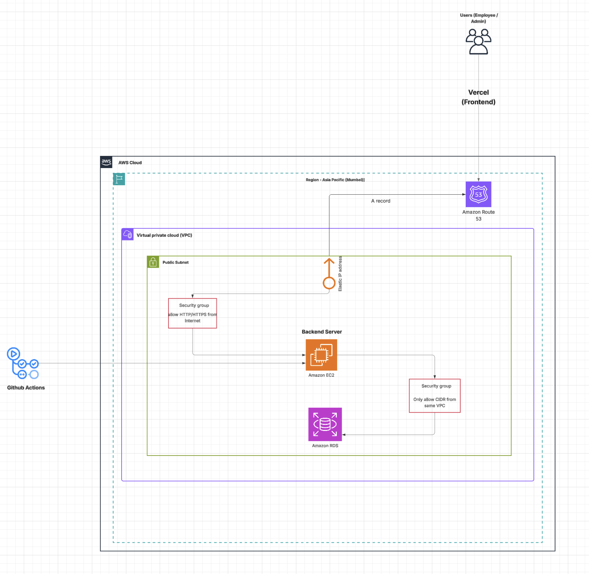

# CI/CD Pipeline and Deployment Flow

This section documents the complete CI/CD workflow for the FastAPI project, including code merge strategy, automated tests, security scanning, and deployment to AWS EC2 using GitHub Actions.

---

## 1. Code Merge Workflow

### Branching Strategy
- **Main Branch (`main`)**: Production-ready, stable code.
- **Feature Branches (`feature/*`)**: Active development is here. Each feature or bug fix has its own branch.
- **CI_CD Branch (`CI_CD`)**: All CI/CD automation is triggered from this branch.

### Workflow Steps
1. Developer raises a Pull Request (PR) into the `CI_CD` branch.
2. GitHub Actions automatically runs:
   - Unit tests  
   - Security scans (Trivy SAST)
3. If all checks pass, the branch is merged.
4. Merge triggers automated deployment to EC2.

---

## 2. Automated Testing (CI)

### Purpose
Ensures all code changes are stable, functional, and production-ready.

### Tools Used
- **Pytest** for test execution  

### Workflow
- On each push to `CI_CD`, GitHub Actions:
  - Installs dependencies from `requirements.txt`
  - Runs all tests:  
    ```bash
    pytest --maxfail=1 --disable-warnings -q
    ```
  - If any test fails, the pipeline stops immediately.

### AWS Deployment Workflow




### SAST (Trivy Report)

```bash
Report Summary

┌──────────────────┬──────┬─────────────────┬─────────┐
│      Target      │ Type │ Vulnerabilities │ Secrets │
├──────────────────┼──────┼─────────────────┼─────────┤
│ requirements.txt │ pip  │        0        │    -    │
└──────────────────┴──────┴─────────────────┴─────────┘
Legend:
- '-': Not scanned
- '0': Clean (no security findings detected)
```

### DAST (ZAP)

- Dast was done on Frontend URL (Got Zero Critical Vulnaribilities)
    
